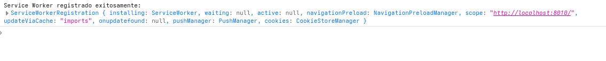

# Tienda Campus - App Shell PWA

Una Progressive Web App (PWA) para la tienda oficial de la Universidad XYZ, implementada con un App Shell pattern para una experiencia rápida y offline. fue servido con python con un servidor virtual 

## 🚀 Características

- **App Shell Pattern**: Arquitectura que separa el shell de la aplicación del contenido dinámico
- **Responsive Design**: Diseño adaptativo para móviles, tablets y desktop
- **Service Worker**: Cacheo offline del App Shell para funcionamiento sin conexión
- **PWA Ready**: Incluye Web App Manifest para instalación en dispositivos
- **Navegación Dinámica**: Tres categorías de productos: Papelería, Electrónica y Snacks
- **Datos JSON**: Lista de productos cargada dinámicamente desde estructura de datos

## 📁 Estructura del Proyecto

```
appShellExam/
├── index.html          # Estructura principal del App Shell
├── styles.css          # Estilos responsive y modernos
├── app.js             # Lógica de navegación y manejo de datos
├── sw.js              # Service Worker para cacheo offline
├── manifest.json      # Web App Manifest para PWA
└── README.md          # Documentación del proyecto
```

## 🛠️ Tecnologías Utilizadas

- **HTML5**: Estructura semántica del App Shell
- **CSS3**: Flexbox, Grid, animaciones y diseño responsive
- **Vanilla JavaScript**: Manejo del DOM y navegación SPA
- **Service Workers**: Estrategia de cacheo para funcionamiento offline
- **Web App Manifest**: Configuración PWA para instalación

## 🎯 Funcionalidades Implementadas

### App Shell
- ✅ Encabezado con título "Tienda Campus"
- ✅ Menú de navegación: Papelería, Electrónica, Snacks
- ✅ Contenedor dinámico para productos
- ✅ Pie de página: "Universidad XYZ – Tienda Campus 2025"


## Evidencia 


## ¿Cómo beneficia a los usuarios cargar rápido el App Shell aunque no haya conexión?
El beneficio de que carge rapido un asi sin conexion a internet es que el usuario puede navegar por la aplicacion sin necesidad de tener internet, lo cual es muy util en lugares donde la conexion es inestable o no hay acceso a internet. Esto mejora la experiencia del usuario al permitirle acceder a la aplicacion de manera rapida y eficiente, incluso en condiciones adversas.

## ¿Qué diferencia hay entre el shell y los productos dinámicos?
El shell es la estructura fija de la aplicacion que incluye elementos como el encabezado, el menu de navegacion y el pie de pagina. Estos elementos permanecen constantes y se cargan rapidamente para proporcionar una experiencia de usuario fluida. Por otro lado, los productos dinamicos son el contenido que cambia dependiendo de la categoria seleccionada por el usuario (Papeleria, Electronica, Snacks). Estos productos se cargan de manera dinamica desde una fuente de datos (como un archivo JSON) y pueden variar en cantidad y detalles. En resumen, el shell proporciona la estructura y navegacion basica, mientras que los productos dinamicos ofrecen el contenido variable que los usuarios desean ver.
